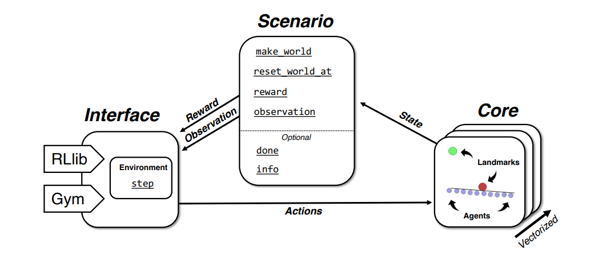
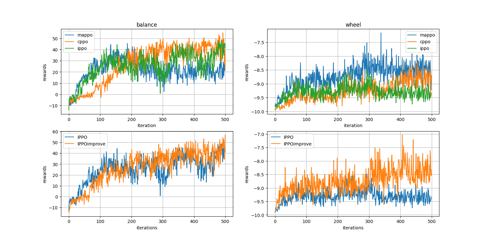

This repo is the final assignment of Game theory and Reinforcement learning of Sun Yat-sen University (autumn of 21).I implemented three MARL algorithms, IPPO, CPPO and MAPPO.And I apply them in [VMAS](https://github.com/proroklab/VectorizedMultiAgentSimulator)  platform.Also, the algorithms I implemented is better than the original paper.Details are in my paper.

Here I want to write code comments for VMAS.

Firstly, I want to introduce how to create envs in VAMS.

```python
env = make_env(
        scenario_name=scenario_name,
        num_envs=num_envs,
        device=device,
        continuous_actions=continuous_actions,
        wrapper=wrapper,
        # Environment specific variables
        n_agents=n_agents,
)
```

In the code above, 'scenario_name' means the game you want to play such as dropout, transport and balance.'num_envs' is the number of parallel environments you want to create.If 'continuous_actions = True', it means the action space of environment is continuous action space.'n_agents' is the number of agents.

Here is an example:

```python
 env = vmas.make_env(
        scenario_name="waterfall",
        num_envs=32,
        device="cpu", # Or "cuda" for GPU
        continuous_actions=True,
        wrapper=None,  # One of: None, vmas.Wrapper.RLLIB, and vmas.Wrapper.GYM
        max_steps=None, # Defines the horizon. None is infinite horizon.
        **kwargs # Additional arguments you want to pass to the scenario initialization
    )
```

Secondly, if you want to interact with envs.You can use the code follow:

```python
obs, rews, dones, info = env.vector_step(actions)
```

1. 'obs': The states of agents after taking actions.
2. 'rews':The rewards after agents taking actions.
3. 'dones':If the game is over, 'dones' will be True.

Then, if you want to start a new game, you can use the code:

```python
state = env.reset()
```

The sentence can reset the game and return the initial states.



Finally, you can get the dimension of observations and actions of each agents by using the code:

```python
n_states = envs.observation_space[0].shape[0]
n_actions = env.action_space[0].n
```



The final result is shown in the picture.